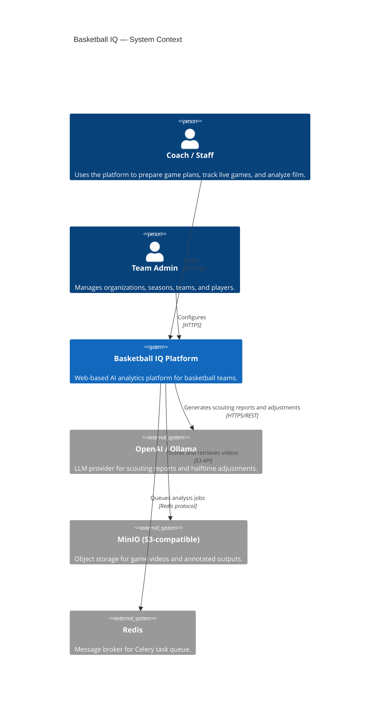
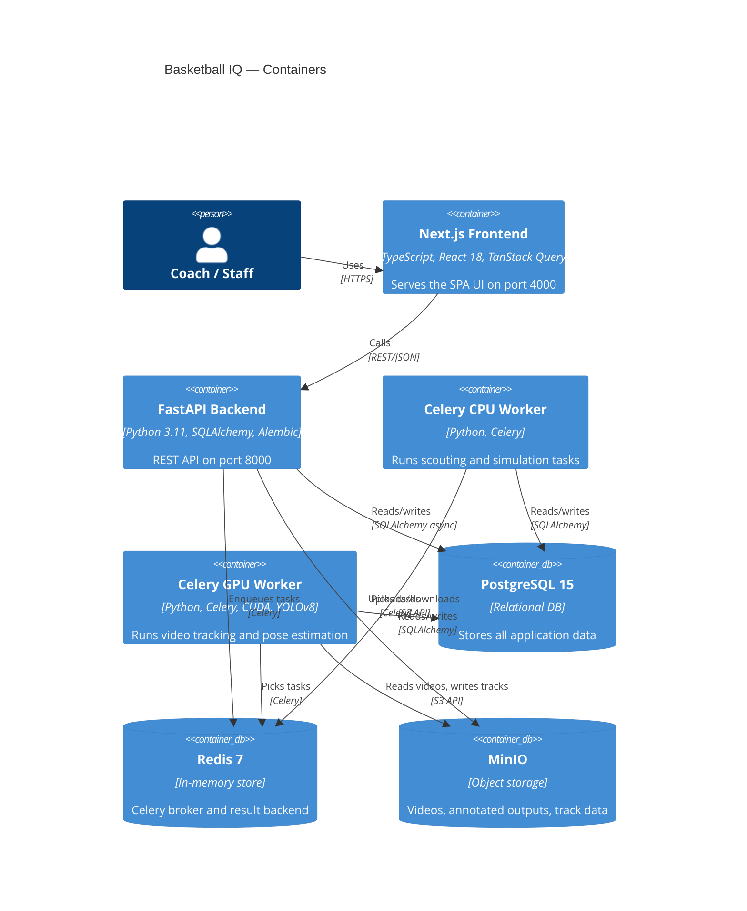
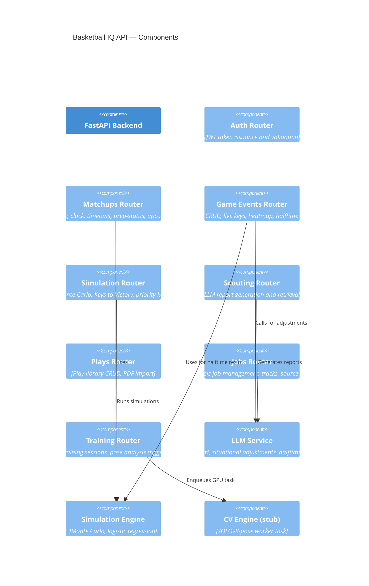

# Architecture

## C4 Context Diagram

## C4 Container Diagram

## C4 Component Diagram (API)

## Technology Stack Summary

| Layer | Technology | Version |
|-------|-----------|---------|
| Frontend | Next.js | 14.2.3 |
| Frontend UI | React | 18 |
| Frontend types | TypeScript | 5 |
| Frontend state | TanStack Query | 5 |
| CSS | Tailwind CSS | 3.4.1 |
| Backend | FastAPI | 0.111+ |
| ORM | SQLAlchemy | 2.0 async |
| Migrations | Alembic | 1.13+ |
| Task queue | Celery | 5.3+ |
| Database | PostgreSQL | 15 |
| Cache/broker | Redis | 7 |
| Storage | MinIO | Latest |
| CV | YOLOv8-pose (ultralytics) | 8.x |
| LLM | OpenAI API / Ollama | — |
