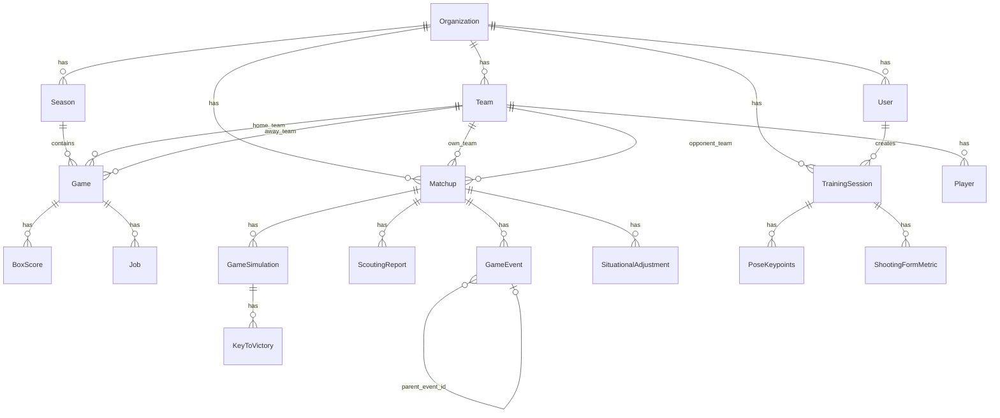

# Data Model

## Entity Relationship Diagram

## Table Reference

### organizations
| Column | Type | Description |
|--------|------|-------------|
| id | UUID PK | |
| name | VARCHAR | Display name |
| slug | VARCHAR UNIQUE | URL-friendly identifier |
| created_at | TIMESTAMPTZ | |

### users
| Column | Type | Description |
|--------|------|-------------|
| id | UUID PK | |
| email | VARCHAR UNIQUE | Login email |
| hashed_password | VARCHAR | bcrypt hash |
| role | ENUM | admin / coach / analyst / viewer |
| organization_id | UUID FK → organizations | |
| is_active | BOOL | |

### teams
| Column | Type | Description |
|--------|------|-------------|
| id | UUID PK | |
| name | VARCHAR | |
| organization_id | UUID FK → organizations | |

### players
| Column | Type | Description |
|--------|------|-------------|
| id | UUID PK | |
| name | VARCHAR | |
| jersey_number | VARCHAR | |
| position | VARCHAR | |
| team_id | UUID FK → teams | |

### seasons
| Column | Type | Description |
|--------|------|-------------|
| id | UUID PK | |
| name | VARCHAR | e.g. "2024-25" |
| year | VARCHAR | |
| organization_id | UUID FK → organizations | |

### games
| Column | Type | Description |
|--------|------|-------------|
| id | UUID PK | |
| season_id | UUID FK → seasons | |
| home_team_id | UUID FK → teams | |
| away_team_id | UUID FK → teams | |
| game_date | DATE | |
| location | VARCHAR | |

### box_scores
| Column | Type | Description |
|--------|------|-------------|
| id | UUID PK | |
| game_id | UUID FK → games | |
| team_id | UUID FK → teams | |
| player_id | UUID FK → players | |
| pts, reb, ast, stl, blk, tov | INT | Per-player stats |
| fg_made, fg_att, fg3_made, fg3_att, ft_made, ft_att | INT | Shooting stats |

### jobs
| Column | Type | Description |
|--------|------|-------------|
| id | UUID PK | |
| game_id | UUID FK → games | |
| status | VARCHAR | pending / running / done / failed |
| current_stage | VARCHAR | Ingestion stage label |
| progress_pct | INT | 0-100 |
| track_data_s3_key | VARCHAR | S3 key for JSONL track file |
| source_video_s3_key | VARCHAR | S3 key for original video |

### matchups
| Column | Type | Description |
|--------|------|-------------|
| id | UUID PK | |
| name | VARCHAR | e.g. "vs Eagles — Dec 20" |
| own_team_id | UUID FK → teams | |
| opponent_team_id | UUID FK → teams | |
| organization_id | UUID FK → organizations | |
| scheduled_at | TIMESTAMPTZ | Game date/time |
| status | VARCHAR | planned / active / completed |
| notes | JSONB | Free-text notes by section |
| game_config | JSONB | `{sport, halves, mins_per_period, timeouts_per_team}` |
| clock_state | JSONB | `{period, time_remaining_seconds, is_paused, timeouts_used_team1/2}` |
| halftime_adjustments | JSONB | LLM-generated halftime adjustments array |

### game_events
| Column | Type | Description |
|--------|------|-------------|
| id | UUID PK | |
| matchup_id | UUID FK → matchups | |
| event_type | VARCHAR | 2pt_made, missed, rebound, etc. |
| team | INT | 1 = own, 2 = opponent |
| points | INT | 0-3 |
| x_pct, y_pct | FLOAT | Court position (0-100%) |
| player_name | VARCHAR | |
| player_jersey | VARCHAR(10) | Jersey number |
| period | INT | Half/quarter number |
| game_time_seconds | INT | Seconds from start of period |
| parent_event_id | UUID FK → game_events | Self-referential for follow-ups |

### game_simulations
| Column | Type | Description |
|--------|------|-------------|
| id | UUID PK | |
| matchup_id | UUID FK → matchups | |
| n_runs | INT | Number of Monte Carlo games |
| win_pct_own / win_pct_opp | FLOAT | 0.0-1.0 |
| avg_score_own / avg_score_opp | FLOAT | |
| score_range_*_low / *_high | FLOAT | |
| base_log_odds | FLOAT | Logistic regression base |

### keys_to_victory
| Column | Type | Description |
|--------|------|-------------|
| id | UUID PK | |
| simulation_id | UUID FK → game_simulations | |
| title | VARCHAR | Human-readable key name |
| description | TEXT | Detail explanation |
| feature_name | VARCHAR | Stat column name used |
| coefficient | FLOAT | Logistic regression coefficient |
| weight | FLOAT | Normalized importance |
| active | BOOL | Toggled by coach |
| is_priority | BOOL | Pinned as priority |
| priority_rank | INT | 1-3 for pinned keys |
| metric_targets | JSONB | Per-player/team tracking targets |
| live_status | VARCHAR | good / on_track / at_risk |

### plays
| Column | Type | Description |
|--------|------|-------------|
| id | UUID PK | |
| name | VARCHAR | |
| category | VARCHAR | Offense / Defense / Special |
| svg_data | TEXT | JSON-encoded canvas state |
| svg_data_version | INT | 1 = single frame, 2 = multi-frame |
| tags | JSONB | Array of string tags |
| pace | VARCHAR | half-court, transition, etc. |
| pdf_url | VARCHAR | MinIO URL for imported PDF |
| linked_matchup_id | UUID FK → matchups | |

### training_sessions
| Column | Type | Description |
|--------|------|-------------|
| id | UUID PK | |
| user_id | UUID FK → users | |
| organization_id | UUID FK → organizations | |
| sport_drill | VARCHAR | Drill name |
| video_s3_key | VARCHAR | S3 key for uploaded clip |
| status | VARCHAR | pending / uploaded / analyzing / done / failed |
| celery_task_id | VARCHAR | For job tracking |

### pose_keypoints
| Column | Type | Description |
|--------|------|-------------|
| id | UUID PK | |
| session_id | UUID FK → training_sessions | |
| frame | INT | Video frame number |
| person_id | INT | Per-person tracking ID |
| keypoints | JSONB | `{"nose": [x, y], "shoulder_l": [x, y], ...}` |
| bbox | JSONB | `[x1, y1, x2, y2]` |
| hoop_bbox | JSONB | Basketball hoop bounding box |
| hoop_conf | FLOAT | Hoop detection confidence |

### shooting_form_metrics
| Column | Type | Description |
|--------|------|-------------|
| id | UUID PK | |
| session_id | UUID FK → training_sessions | |
| frame | INT | |
| person_id | INT | |
| elbow_l, elbow_r | FLOAT | Joint angles in degrees |
| knee_l, knee_r | FLOAT | |
| hip_l, hip_r | FLOAT | |
| torso_lean | FLOAT | |
| back_angle | FLOAT | |
| release_angle | FLOAT | |
| depth | FLOAT | Squat depth estimate |
